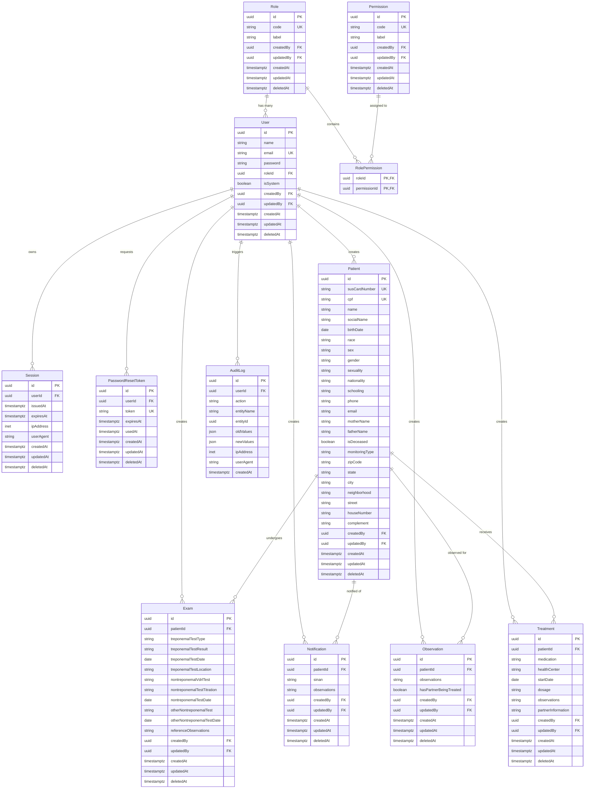

# Database Schema

The following diagram represents the core entity relationships within the SIMCASI database:

> **Note:** This diagram focuses on relationships and core field types. For indexes, `CASCADE` rules, constraints, and optional fields, refer to [prisma/schema.prisma](../prisma/schema.prisma).
